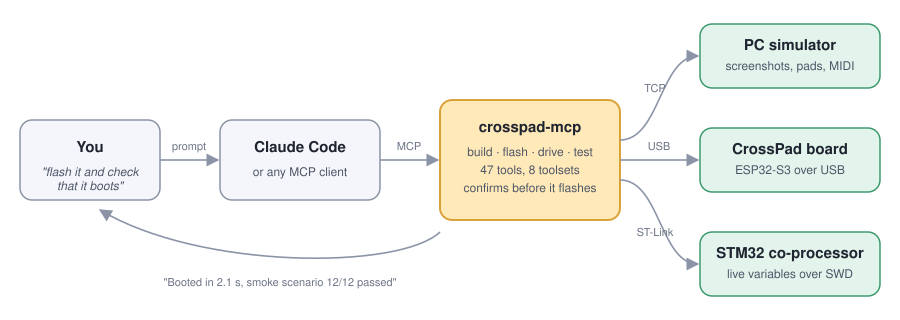
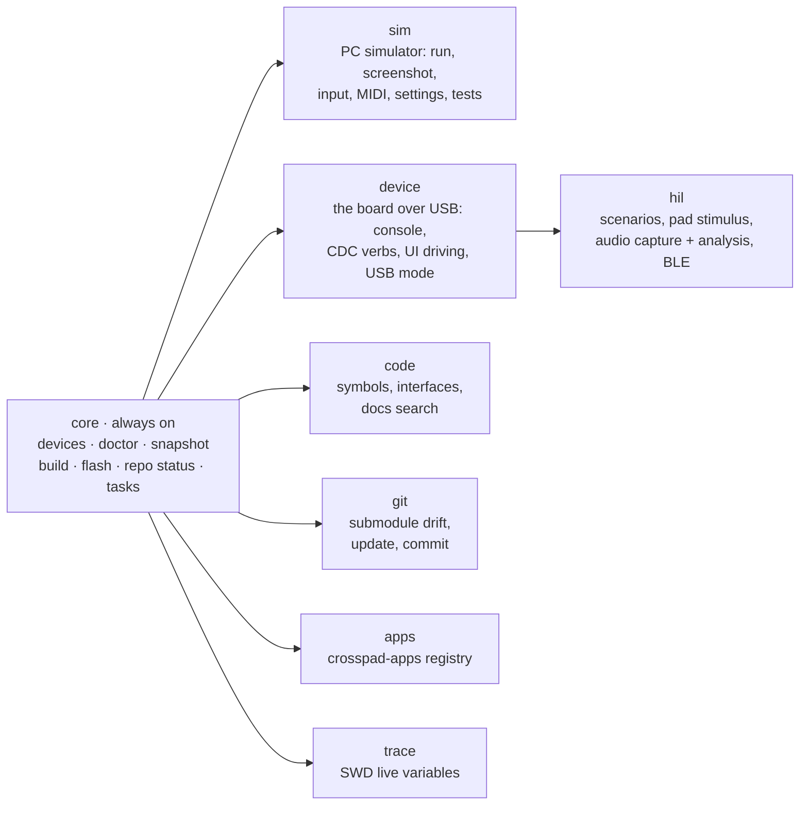

# crosspad-mcp

[](https://www.npmjs.com/package/crosspad-mcp-server)
[](https://m8ven.ai/mcp/crosspad-crosspad-mcp-11gso3)
[](https://github.com/CrossPad/crosspad-mcp/actions/workflows/ci.yml)
[](package.json)
[](#license)

**Talk to your CrossPad. Let Claude do the toolchain.**

crosspad-mcp is an [MCP](https://modelcontextprotocol.io) server that teaches
Claude Code (or any MCP client) how to develop for the
[CrossPad](https://github.com/CrossPad) pad controller. You say *"flash the
new build and check that it boots"*; it runs the ESP-IDF build, asks you to
confirm the flash, opens the console, runs the smoke scenario and tells you
what happened — with the hardware traps already built in, so you don't have
to remember which serial port reboots the board when you open it.

<p align="center">
  
</p>

## What you can do with it

Every card is a real prompt. The tools named underneath are what runs — you
never have to call them yourself.

| Say this… | …and this happens |
|---|---|
| **"Build the firmware and flash it over OTA."** | `crosspad_build platform=idf` streams the build, `crosspad_flash transport=ota` asks for confirmation, then streams the upload. New app directories are detected and the `fullclean` is done for you. |
| **"Show me what's on the simulator screen."** | `crosspad_run` launches the PC sim, `crosspad_screenshot` returns the LCD as an image Claude can actually look at. Then *"press pad 5"*, *"turn the encoder left twice"* — `crosspad_input`. |
| **"Play a drum pattern on the pads and record what comes out."** | `crosspad_stimulus` hits the pads with real timings, `crosspad_capture` records the board through its own USB-audio endpoint, `crosspad_analyze` gives a verdict (onsets, clicks, silence, velocity curve). |
| **"Why did it crash?"** | `crosspad_diagnose_crash` — reset reason, registers, backtrace decoded against the ELF that is *actually* flashed, heap after restart. One call. |
| **"Watch the battery charger state machine while I plug the cable in."** | `crosspad_trace` polls STM32 variables live over ST-Link without halting the core, and plots them. |
| **"Install the sampler app and rebuild."** | `crosspad_apps_install app_name=sampler` adds the submodule from the [crosspad-apps](https://github.com/CrossPad/crosspad-apps) registry, then a clean build. |
| **"Where is `IPadLogicHandler` implemented?"** | `crosspad_interface_implementations` across every repo of the ecosystem, or `crosspad_symbol` for clangd-precise definitions and call hierarchies. |
| **"Is my board even connected?"** | `crosspad_devices` and `crosspad_doctor` — which USB mode it is in, which ports belong to it, what is missing on the host, and how to fix each thing. |

## Quick start

```bash
claude mcp add crosspad -- npx -y crosspad-mcp-server
```

Restart Claude Code, then ask:

> *is my CrossPad connected, and is the toolchain set up?*

That runs `crosspad_doctor`. Every failed check comes with a `fix`. The server
assumes your repos live side by side under `~/GIT/` — if they don't,
[set the paths](docs/USAGE.md#configuration) once.

Installing the bundled `crosspad` skill gives Claude the ecosystem map, the
per-role guides and the hardware traps up front:

```
/plugin marketplace add CrossPad/crosspad-mcp
/plugin install crosspad@crosspad
```

## How it is organised

Only the `core` toolset is visible when the server starts, so the tool list
stays small. Claude enables the others as the conversation needs them — or you
start the server with `--toolsets device,sim`.



Anything that writes to a device or your host is tiered. Flashing, DFU and
SWD writes come back as *confirmation required* first; `--read-only` removes
every writing tool from the list entirely. Long operations (builds, flashes,
scenarios) run as tasks you can check on, wait for or cancel.

## Who is it for

- **You build and drive CrossPad firmware** — mostly the simulator, sometimes
  the board. Start with the [user guide](skills/crosspad/reference/role-user.md).
- **You work on the firmware itself** — flash, console, HIL scenarios, crash
  diagnosis, SWD. Read the [firmware developer guide](skills/crosspad/reference/role-fw-dev.md)
  and [HIL testing](skills/crosspad/reference/hil-testing.md).
- **You want to extend this server** — the
  [contributor guide](skills/crosspad/reference/role-contributor.md) and the
  [Development section](docs/USAGE.md#development).

## Going deeper

- [**Usage reference**](docs/USAGE.md) — every install path, every tool and
  toolset, resources and prompts, configuration, HTTP transport, the v10
  migration table.
- [FAQ](skills/crosspad/reference/faq.md) — the questions that cost people an
  afternoon.
- [CHANGELOG](CHANGELOG.md)

## License

MIT — part of the [CrossPad](https://github.com/CrossPad) project.
